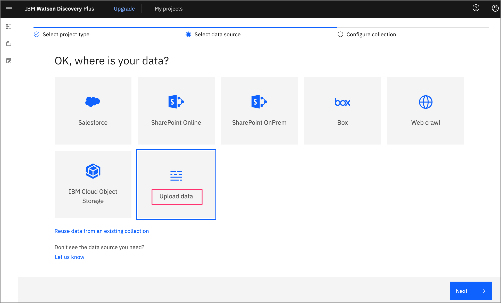
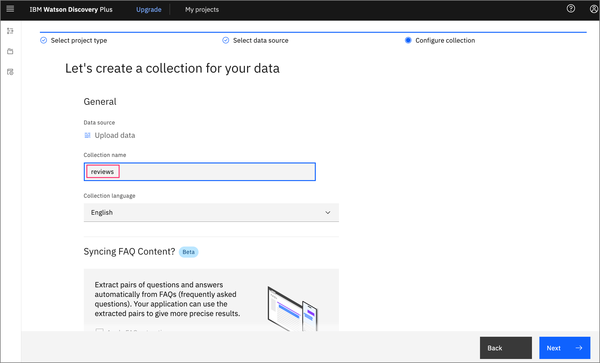
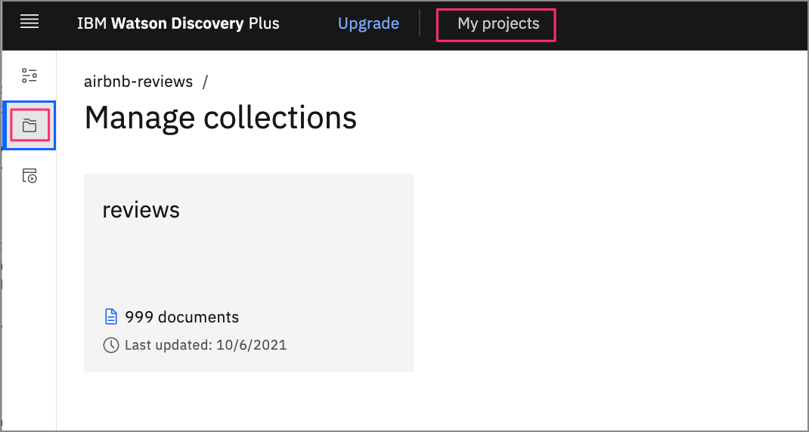
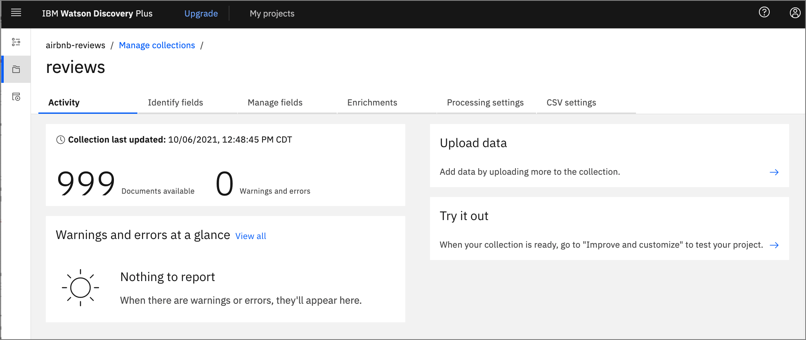
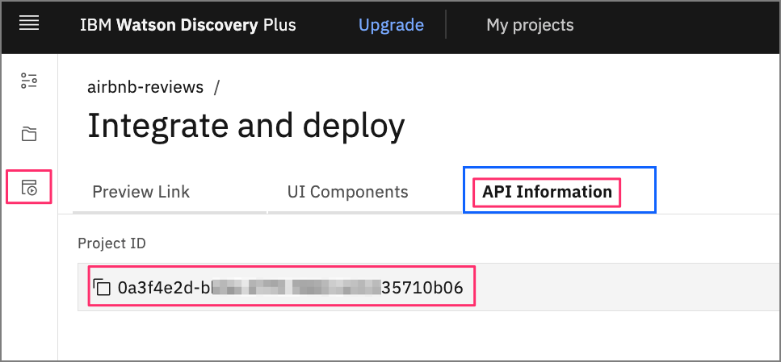

# How to integrate the Watson Discovery UI components into your application

The main benefit of using the Watson Discovery service is its powerful analytics engine that provides cognitive enrichments and insights into your data.

This tutorial showcases a new feature of the Discovery service -- Watson Discovery UI components. These components are tied directly to your Discovery projects and can easily be plugged into your search application. The components are self-contained and don't require any additional API calls to the Discovery service to retrieve data.

## Learning objectives

In this tutorial, you will learn how to navigate the Watson Discovery tooling to load and manage your data. This will include enhancing the enrichments applied to your data and building a custom panel to query and visualize your data.

You will then learn how to replicate your search panel in your own application. The application will be built using [React](https://reactjs.org/) and [Express](https://expressjs.com/) and will feature the Watson Discovery UI components.

## Prerequisites

To follow along with this tutorial, you need to have an IBM Cloud account where you can provision an instance of Watson Discovery.

## Estimated time

Completing this tutorial should take about 60 minutes.

## Steps

1. [Launch Watson Discovery](#launch-watson-discovery)
1. [Create a new project](#create-a-new-project)
1. [Upload data files into collection](#upload-data-files-into-collection)
1. [Enrich the data](#enrich-the-data)
1. [Add enrichments to search panel](#add-enrichments-to-search-panel)
1. [Create our UI app](#create-our-ui-app)
1. [Key files and concepts](#key-files-and-concepts)

### Launch Watson Discovery

If you do not have an IBM Cloud account, register for a free trial account [here](https://cloud.ibm.com/registration).

Using your IBM Cloud account, create a Watson Discovery instance from the [resource catalog](https://cloud.ibm.com/catalog/services/discovery) and select the default `Plus` plan.

>**NOTE**: The first instance of the `Plus` plan for IBM Watson Discovery comes with a free 30-day trial; it is chargeable once the trial is over. If you no longer require your Plus instance for Watson Discovery after going through this exercise, feel free to delete it.


From the Discovery instance page, click the `Launch Watson Discovery` button.

### Create a new project

The landing page for the Discovery service will show you a list of current projects.


Click `New project`.


For this tutorial we will be creating a `Document Retrival` type of project. Select that `Project type` and provide a unique name for your project, then click `Next`.

### Upload data files into collection

The next step is telling Discovery where your data will come from.



In our case, we will be uploading our data from JSON data files, so click the `Upload data` option and then click `Next`.



On this panel we just need to provide a unique name for our data collection.

>**IMPORTANT**: Projects can contain multiple collections. When Discovery performs a search, it is at the project level, and by default includes all of the collections within that project.

Enter a `Collection name` and then click `Next`.


From the upload panel, click on the `Drag and drop files here or upload` text. This will bring up a file dialog where you can select what files to upload.

For this tutorial, we will be using 999 reviews submitted by AirBnB customers in Austin, TX. Each review has a title, the AirBnB location and host name, the reviewers name, a rating score, and the text of the review.

Select the AirBnB reviews located [here](data). **!!! FIX LINK !!!!**

Once you complete the action, click `Finish`.

Your data will now start to upload. Discovery will provide alerts to tell you when the upload is complete.

### Enrich the data

Click the `Manage collections` tab in the left toolbar to show all the collections associated with your project.

>**NOTE**: Click on the `My projects` button at the top of the page to view and select which project your are currently working on.



Click on the new collection you just created.



Here you see that all 999 reviews have been loaded.

Click on the `Enrichments` tab.


As you can see, the default enrichments are `Part of speech` and `Entities v2`. For our review data, we would also like to include `Keywords` and `Sentiment of Document`.

For each of these new enrichments, click on `Fields to enrich` and select the `text` field.

### Add enrichments to search panel

Now that we have some new enrichments, let's add them to our default search panel.

Click the `Improve and customize` tab in the left toolbar to display the search panel associated with your collection.


To customize the display, we will add all the facets. To start, click the dropdown menu for the `Customize display` option located on the right side of the panel.

Then click `Facets`, `New facet`, and finally `From existing fields in collection`.


For our `Keyword` facet, select the field `enriched_text.keywords.mentions.text`. This will provide the most common keywords found in the data.

Provide a meaningful label for the UI component, then click `Apply`.


Now do the same for `Sentiment`, but use the field `enriched_text.sentiment.score`.


Once complete, you see how the facets are now a part of the search panel.


If you enter a search string, you will see the results displayed, as well as new facet values that reflect the subset of reviews that match the search.


If you click on `View passage in document` for any of the reviews, you will drill-down into the review data. If you click on the `JSON` tab, you can see the actual result that is returned by Discovery.


Notice that in this case, the search found a match with the `title` of the review. The actual review is shown in the `text` field.

### Create our UI app

Now that your search panel has been enhanced to show all the interesting facets of the data, let's build an application that will display that same panel.

For this task, we will be using the starter kit provided by Watson Disovery. [Here](https://github.com/watson-developer-cloud/discovery-components) is a link to the documentation.

It provides multiple ways to develop your app, but we will choose the manual method to integrate our Discovery collection with their example app.

#### Clone the repo

To get started, you first need to clone their GitHub repo to your local system.

```bash
$ git clone https://github.com/watson-developer-cloud/discovery-components.git
$ cd journeys/discovery-components
```

#### Gather your credentials

Return to IBM Cloud and your Watson Discovery launch panel to get your API key and service URL:


You will also need your project ID which you can get from the Watson Discovery `Integrate and deploy` panel for your project.



#### Add credentials to environment files

From the root directory of your local repo, execute these commands to create the environment files. Note that the files must be created in the `examples/discovery-search-app` directory.

```bash
$ cd examples/discovery-search-app
$ cp .env .env.local
$ echo "DISCOVERY_AUTH_TYPE=iam 
DISCOVERY_URL=<replace with discovery URL>
DISCOVERY_APIKEY=<replace with API key>" > ibm-credentials.env
```

Update the `ibm-credentials.env` file with your Discovery credentials, and update the `.env.local` file with your project id.

#### Build and run the app

Now we can return to our project root directory to build and start our app.

The following commands require that the [Yarn](https://yarnpkg.com/) package manager be installed on your local system.

```bash
$ cd ../..
$ yarn workspace @ibm-watson/discovery-react-components run build
$ yarn workspace discovery-search-app run start
```

Once started, a browser should open up with the base search panel displayed. Enter a search string to view the list of matching reviews.


Notice that all of the facets we added in the Discovery tooling show up here.

## Key files and concepts

The Discovery UI app consists of a React client and Express server.

To explore the code, navigate to the `examples/discovery-search-app` sub-directory. There you will find the React code in the `src` directory, and the Express code in the `server.js` file.

Here you see the Discovery UI React components being imported.

```js
// examples/disovery-search-app/src/App.js

import {
  DiscoverySearch,
  SearchContext,
  SearchApi,
  SearchInput,
  SearchResults,
  SearchFacets,
  ResultsPagination,
  DocumentPreview,
  CIDocument,
  canRenderCIDocument
} from '@ibm-watson/discovery-react-components';

...

    <DiscoverySearch searchClient={searchClient} projectId={projectId}>
      <AppView />
    </DiscoverySearch>

```

In the above list, the main component is `DiscoverySearch`. It requires that the Discovery client and project ID be passed in as parameters. This allows all of the details of each component to be self-contained, which means no additional programming is required to use them.

>**NOTE**: Before these UI components were developed, you would need to create your own UI components and tie them to your Discovery data using the Watson Discovery API. While the provided components provide a good starting point to handle the most common UI components found in a typical Discovery search application, you will still need to use the old approach for any advanced custom components (for example, a line graph chart to show sentiment score trends over time).

For the client to have access to the Discovery service instance, we either have to fetch that from the server or instantiate our Discovery service on the client side. In the example app, this is done using a proxy -- which is initiated by the client making a call to instantiate a Discovery instance.

```js
// examples/disovery-search-app/src/App.js

const authenticator = new NoAuthAuthenticator();
const searchClient = new DiscoveryV2({
  url: `${window.location.href}api`,
  version: '2019-01-01',
  authenticator
});
```

The URL, however, in this case is a route to the server (note that `api` is appended to the route). The server code uses a proxy to handle this route.

```js
// examples/disovery-search-app/server.js

const express = require('express');
const app = express();
const proxy = require('./src/setupProxy.js');

...
proxy(app);
```

When the proxy is called with this route, it actually does the work of using the credentials file to get and return an authorization token from the Discovery service.

```js
// examples/disovery-search-app/src/setupProxy.js

const addAuthorization = async (req, _res, next) => {
  const authenticator = getAuthenticatorFromEnvironment('discovery');
  try {
    const accessToken = await authenticator.tokenManager.getToken();
    req.headers.authorization = `Bearer ${accessToken}`;
  } catch (e) {
    console.error(e);
  }
  return next();
};

...

app.use(
  '/api',
  addAuthorization,
  proxy({
    ...
  })
);
```

From the client-side perspective, the call to instantiate a Discovery service instance works because the authenticator is substituted with an actual token. This also means the client doesn't have to worry about  embedding the credentials in the client code or making them visible in the browser console.

## Summary

In this tutorial, we detailed how to navigate the Watson Discovery tooling to create a project and upload data into a collection. We then showed how to enrich the data and build a custom search panel to query and visualize the data.

Lastly, we replicated the same search panel in a custom application by utilizing the Watson Discovery UI Components.
